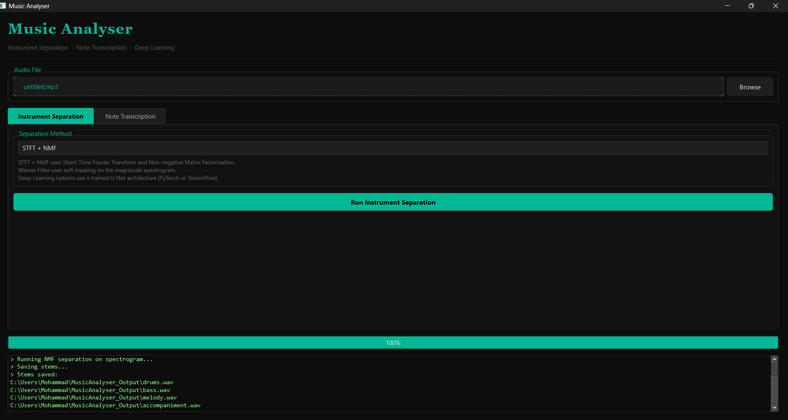
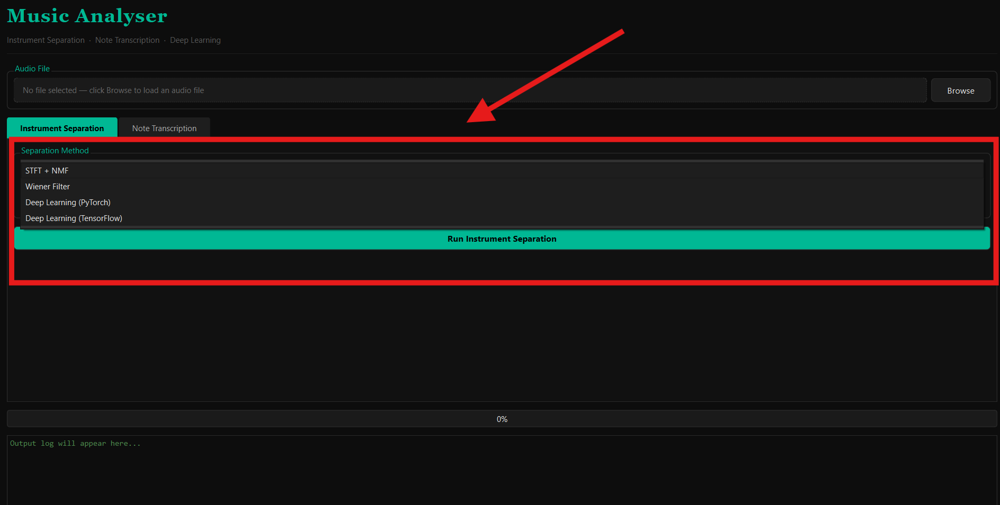
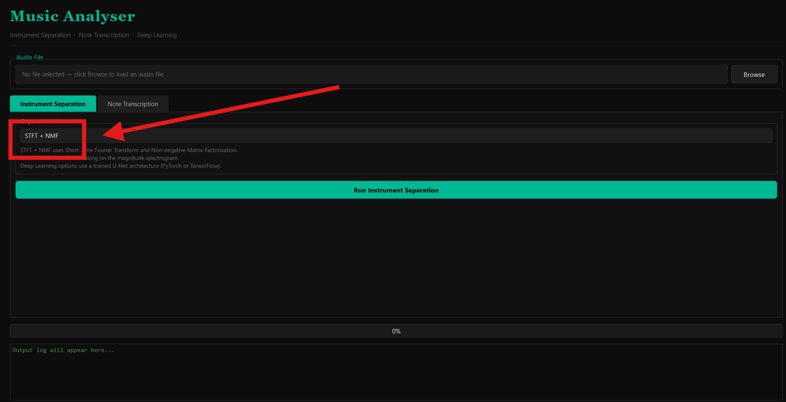
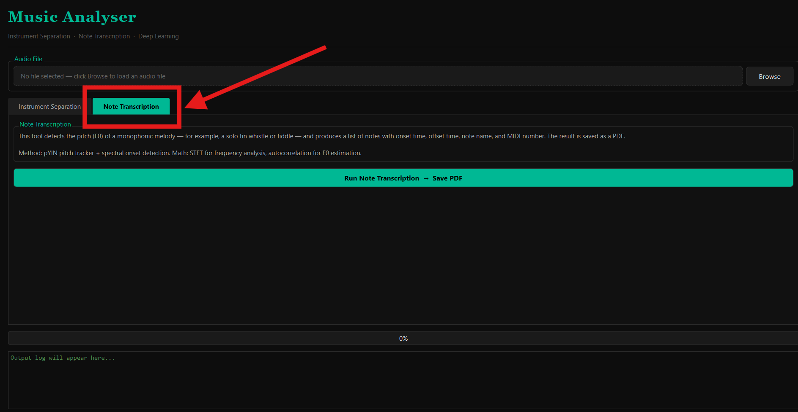
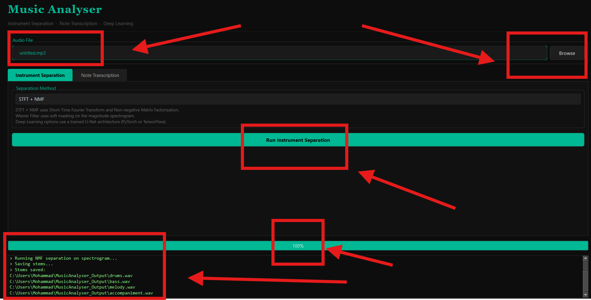
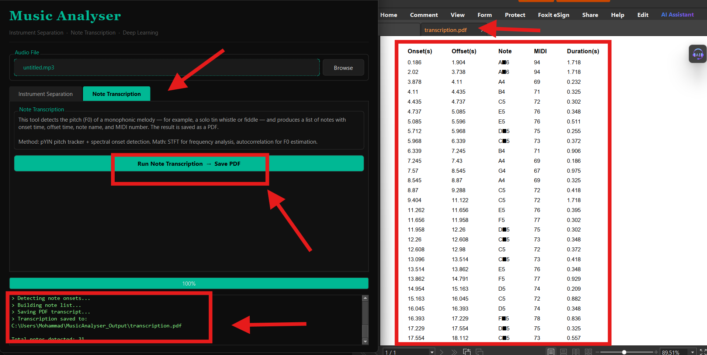

#  Music Analyser

## Overview

You can see screenshots of different parts of the software below in the images or watch an demo of that in the video on [YouTube](https://youtu.be/F0rQhCnkVH8?is=inAHVaLwLCwNIQw4).







---

## Description
A desktop tool for separating instruments from audio files and transcribing melody notes to PDF. Built for research on  traditional music. Runs on Windows, macOS, and Linux.
---

## Features

- Instrument separation using STFT + NMF, Wiener filtering, or Deep Learning (PyTorch / TensorFlow)
- Melody note transcription using pYIN pitch tracker — outputs a PDF with onset times, note names, and MIDI numbers
- Clean dark-themed GUI (PyQt6)
- Modular design — swap the separation backend without changing the interface
---

## Quick Start

```bash
pip install -r requirements.txt
python main.py
```


## Project Structure

```
audio_tool/
├── main.py            # Main application window and worker threads
├── requirements.txt   # Python dependencies
├── screenshot1.png    # Main window
├── screenshot2.png    # Separation tab
├── screenshot3.png    # Method selection
├── screenshot4.png    # Transcription tab
├── screenshot5.png    # Processing log
├── screenshot6.png    # PDF output
└── README.md
```
---

## How It Works

### Instrument Separation
1. Audio is loaded with Librosa and converted to a stereo array.

2. STFT is applied to convert the audio from time domain to frequency domain:
```
X[k, m] = sum( x[n + m*H] * w[n] * e^(-j*2*pi*k*n/N) )

  where:
    N = FFT size (2048)
    H = hop length (512)
    w[n] = Hann window
    k = frequency bin index
    m = time frame index
```
3. The magnitude spectrogram |X| is factorised using NMF:
```
V ≈ W * H

  where:
    V = magnitude spectrogram  (shape: freq x time)
    W = basis spectra matrix   (shape: freq x components)
    H = activation matrix      (shape: components x time)
    All values >= 0
```

4. Each component is reconstructed using a soft Wiener mask and converted back to audio via inverse STFT.

5. When a Deep Learning method is selected, a U-Net model applies learned masks to the spectrogram instead of NMF.
---

### Note Transcription

1. pYIN estimates the fundamental frequency F0 frame by frame using probabilistic YIN algorithm.

2. Mel scale conversion for perceptual frequency mapping:

```
mel(f) = 2595 * log10(1 + f / 700)
```

3. Onset detection finds note boundaries from local maxima in spectral flux.

4. Each note's average F0 is converted to MIDI number:

```
MIDI = 69 + 12 * log2(F0 / 440)
```

5. Results are written to a PDF using ReportLab — one row per note with onset time, offset time, note name, MIDI number, and duration.
---

## Notes

- For best results on  traditional music, use WAV or FLAC (not compressed MP3).
- Deep Learning modes require PyTorch or TensorFlow to be installed separately (see requirements.txt).
- Output files are saved to `~/MusicAnalyser_Output/` by default.
